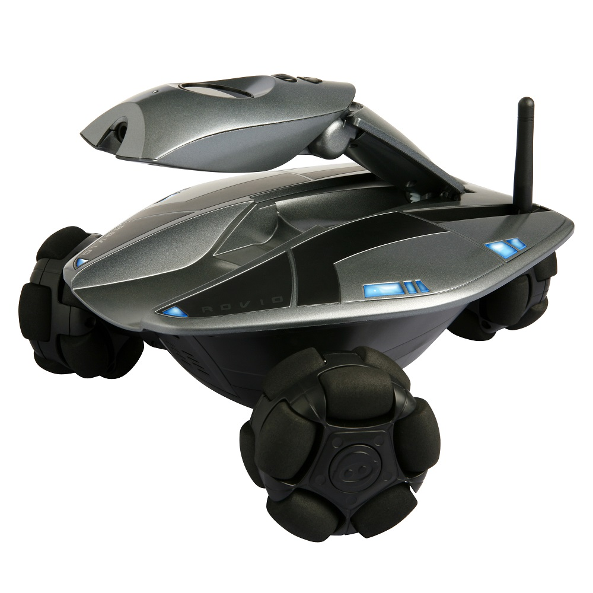

# Rovio Seeker

## Our team:

1. Ong Jia Aun
2. Fatin Binti Abdul Halim
3. Daniela Ivy Ganis Albert
4. Faiz
5. Nabil
6. Sina Meraji

## Lecturer:

[Dr. Zati Hakim binti Azizul Hasan](https://umexpert.um.edu.my/zati)

